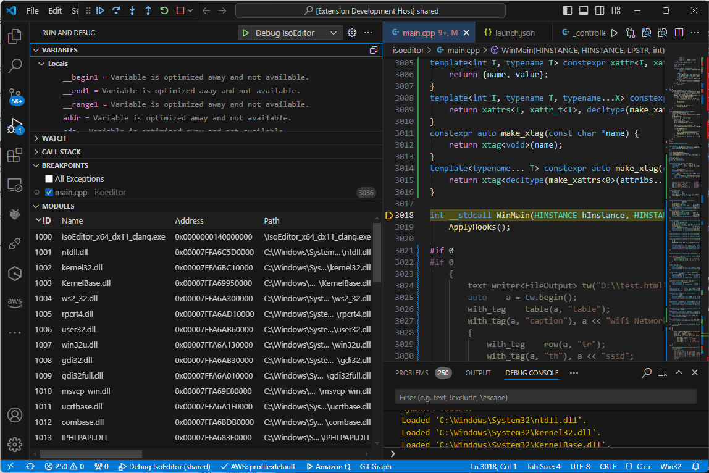

# Modules Debug Pane

This extension provides a modules pane in the debug view, showing loaded modules (dlls)

## What's New
Um, it working? Just found out my package.json was skipping some file.
Also, changed the icon.

## More Information
As far as I can tell, this doesn't already exist, though some debugger extensions provide their own.

This extension is *intended* to work with any debugger using DebugAdapterProtocol, though it has had limited testing outside cppvsdbg and cppdbg. If you encounter problems please report.

The table adapts to the various optional fields the debug adapter supports. In the case of cppvsdbg I am augmenting the modules with the addressRange which cppvsdbg does not provide; other adapters might benefit from similar workarounds.

## Author
Adrian Stephens

