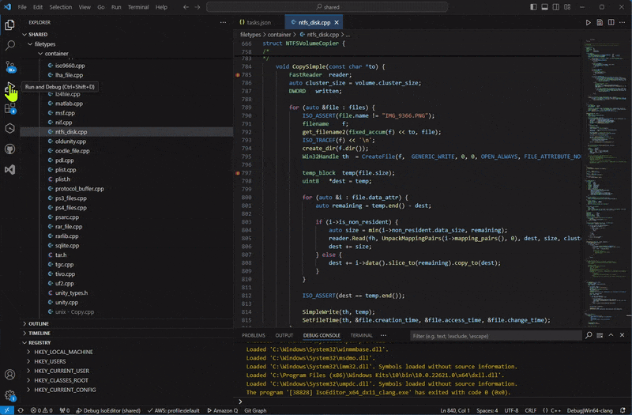

# Modules Debug Pane

This extension provides a modules pane in the debug view, showing loaded modules (dlls), and/or loaded source files for languages like javascript.

## What's New

To celebrate reaching 1000 installs, I've added some stuff...

### Module inspection:

This extension provides custom read-only editors for the following filetypes, allowing them to be inspected from the module view or elsewhere:

- PE: Portable executables, i.e. windows dll and exe files
- MACH: macOS dylibs and executables.
- ELF: most other architectures, unix and game consoles.

Each is displayed in a collapsible tree-like view and will open additional editors to inspect memory.

While the debugger is active, memory that is marked as executable will be disassembled; otherwise it is displayed in a hex editor (see below).

For PE files, selecting imported symbols will try to open another editor for the target dll.

### Hex Viewer
The standard vscode hex-editor (ms-vscode.hexeditor) didn't seem to provide the hooks I needed, so this extension provides its own. It can be used as a replacement for the standard editor everywhere except, for some reason, watch windows.
- view data in base 2, 8, 10 or 16
- instantly see the data under the cursor in multiple formats
- select multiple bytes to see multi-byte values (e.g. 2, 4, or 8 byte floats)
- highlight regions and set colours
- dynamic bytes-per-line based on editor width, or a selectable fixed number
- text view with selectable encoding

## Javascript
Instead of modules, 'source objects' are added to the modules pane, so you can tell what files the javascript runtime has loaded in the course of execution, and sort and open them.

## More Information
As far as I can tell, this doesn't already exist, though some debugger extensions provide their own.

This extension is *intended* to work with any debugger using DebugAdapterProtocol, though it has had limited testing outside cppvsdbg and cppdbg. If you encounter problems please report.

The table adapts to the various optional fields the debug adapter supports. In the case of cppvsdbg I am augmenting the modules with the addressRange which cppvsdbg does not provide; other adapters might benefit from similar workarounds.

Next update at 1000000 installs...

## Author
Adrian Stephens

